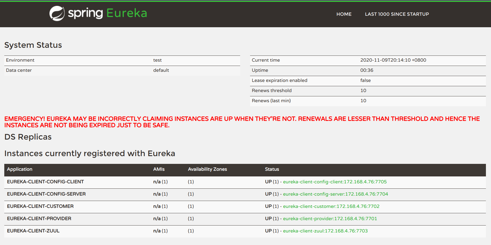

# SpringCloud Netflix微服务学习记录
## 参照教程：https://www.cnblogs.com/xiaostudy/p/12729611.html
## 总结：
此微服务采用SpringCloud Netflix编写，这是一个微服务最简单的框架，根目录下有个pom.xml是用来配置模块和全局编译信息的，服务中IP是7700开始的，模块执行顺序为：
eureka-server(端口7700) --> eureka-client-config-server(端口7704) --> eureka-client-config-client(端口7705) --> eureka-client-zuul(端口7703) --> eureka-client-provider(端口7701) --> eureka-client-customer(端口7702)


## 服务列表解析
### common服务
common是maven的父配置文件，所有的模块都继承自common模块，在这个配置文件中可以配置Spring Security的账号密码以及版本信息、resources目录等，让继承者不用重复写固定配置，由于只用到Maven配置，所有没有src目录。
### eureka-server服务注册中心7700
eureka-server是eureka服务注册中心，所有服务都会被注册到注册中心，可访问http://localhost:7700 来查看注册的服务，如果需要输入密码可查看或者配置common模块配置文件中Spring Security的账号密码（默认账号qifen密码123456）。
```xml
<!--common中pom.xml配置账号密码-->
<eureka.user.name>qifen</eureka.user.name>
<eureka.user.password>123456</eureka.user.password>
```
### eureka-client-provider服务提供者7701
服务中ProviderController类定义了一个ip:port/provider/{txt}接口，并且定义了一个FeignTest接口，用来请求本服务的ProviderController中的test方法。
### eureka-client-customer服务消费者7702
服务中CustomerController类定义了一个ip:port/{txt}接口，引用的是eureka-client-provider的FeignTest类的test方法，引用方法是在pom.xml中引入eureka-client-provider模块，可访问http://localhost:7701/test/abcdef 返回 参数：abcdef，服务实际上是调用了eureka-client-provider服务的FeignTest的test方法。
### eureka-client-zuul路由转发7703
http://localhost:7703/zuul/test/aaa  provider的/test转发到zuul的/zuul/test，也可直接访问http://localhost:7703/test/aaa 访问的是eureka-client-customer的/test/{txt}接口，返回的都是aaa，具体配置在application.yml中。
### eureka-client-config-server配置中心服务7704
在resources中创建config文件夹再创建对应的文件夹和配置
### eureka-client-config-client配置客户端7705
在eureka-client-config-client使用eureka-client-config-server中的配置，把application.yml改为bootstrap.yml,并且配置配置中心，在ConfigClient中使用配置中心的配置，访问http://localhost:7705/config 可查看配置，改变bootstrap.yml的label和profile可再次访问/config，发现配置改变


